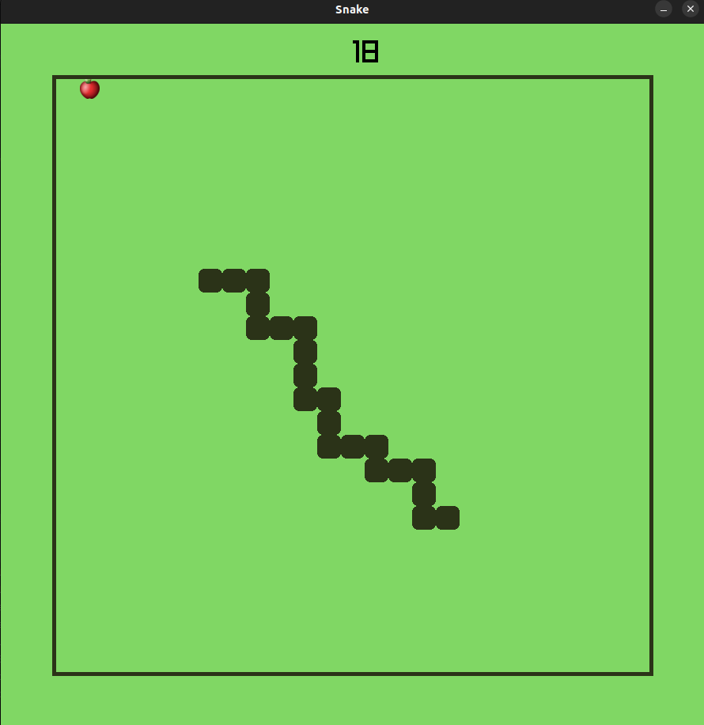
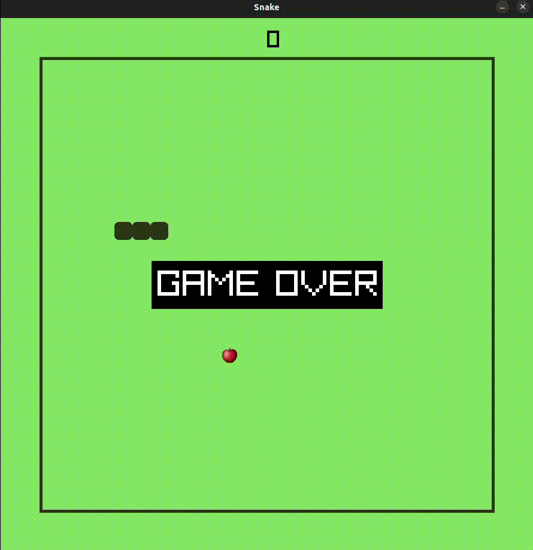

It's a small project for c++ course I was taking at AGH.

  <h2>To launch the game you have to:</h2>
1. Install and setup <strong>raylib</strong> library on your computer.

- I recommend using tutorials from official raylib github repository:

  > [Working on GNU/Linux](https://github.com/raysan5/raylib/wiki/Working-on-GNU-Linux)

  > [Working on Windows](https://github.com/raysan5/raylib/wiki/Working-on-Windows)

  > [Working on macOS](https://github.com/raysan5/raylib/wiki/Working-on-macOS)

2. Git clone or download the repository, build the project and enjoy the game!
- The file that contains the game "engine" is the <strong>main.cpp</strong>.
  
  <h2>How to play the game?</h2>

- you controll the snake using arrows
- if you hit the wall or your body the game is over and you start again
- the score is at the top of the screen

